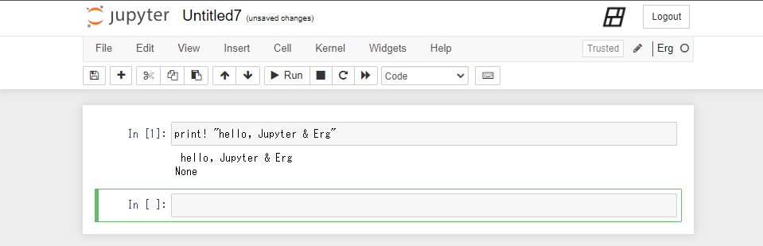

# Jupyter-erg

This project will allow Erg to be used with Jupyter.



## Requirements

* Erg 0.4.6 or later
* Python3

## Installation

> __Warning__: Currently this project only supports Linux and Mac OS X. You can use WSL2 on Windows.

```console
git clone https://github.com/erg-lang/jupyter-erg.git
cd jupyter-erg
pip install -e . # or `pip3 install -e .` if you have both Python 2 and 3 installed
python -m erg_kernel.install # or `python3 -m erg_kernel.install` if you have both Python 2 and 3 installed
```

## Starting Jupyter

```console
jupyter notebook
```

### WSL2

```console
~/.local/bin/jupyter notebook
```

## License

This project is currently appropriating code from [bash_kernel](https://github.com/takluyver/bash_kernel).

See [LICENSE-BSD](./LICENSE-BSD) and [LICENSE-APACHE](./LICENSE-APACHE) for licenses.
